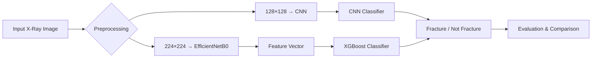

# Bone_Fracture_Detection_Project

# Fracture Detection using CNN and XGBoost

## 1. Title and Short Description
This project implements **automated bone fracture detection** using X-ray images.  
It compares two machine learning approaches:
- A **Convolutional Neural Network (CNN)** trained end-to-end on images.
- An **XGBoost model** trained on deep features extracted via **EfficientNetB0**.

### Why it matters
Fracture detection is a critical diagnostic step in orthopedics. Manual X-ray interpretation can be error-prone and time-consuming, especially in emergency settings.  
This system aims to assist radiologists by automating fracture identification and comparing traditional and deep learning approaches.

**Key Outcome:**  
XGBoost achieved better accuracy (0.75) and AUC (0.8253) compared to CNN (accuracy = 0.6083, AUC = 0.7432), demonstrating that hybrid ML + deep feature methods can outperform standalone CNNs on smaller datasets.

---

## 2. Dataset Source
- **Dataset:** Publicly available X-ray dataset of fractured and non-fractured bones.
- **Total Samples:** ≈ 2,800 images.
- **Classes:**  
  - `fractured`  
  - `not fractured`
- **Data Split:** 70 % train, 20 % validation, 10 % test.
- **Source:** Open-access medical image datasets (e.g., Kaggle “Bone Fracture X-ray” dataset).

### Preprocessing
- Corrupted images removed.
- Normalized to pixel range `[0, 1]`.
- Image augmentation applied: random rotation (±10°), zoom (±5 %), horizontal flips.
- Deep features (1280-dimensional vectors) extracted using EfficientNetB0’s global pooling layer.

---

## 3. Methods

### Architecture Overview
| Stage | Description |
|-------|--------------|
| **CNN Model** | 3× Conv2D + MaxPooling layers → Dense(128) + Dropout(0.5) → Sigmoid output. |
| **Feature Extractor** | EfficientNetB0 pretrained on ImageNet (used to generate embeddings). |
| **XGBoost Classifier** | Trained on extracted embeddings to predict fracture presence. |

### Workflow Diagram



#Fracture Detection using CNN and XGBoost

## 🧠 Why These Methods

- **CNN** learns **spatial visual cues** such as bone discontinuities, texture patterns, and shape irregularities directly from raw pixel values — ideal for detecting fractures in X-ray imagery.  

- **EfficientNet + XGBoost** provides a **compact, interpretable, and data-efficient pipeline**, combining pretrained visual feature extraction with a robust tree-based classifier.  

- This **hybrid comparison** highlights the **trade-offs** between:
  - End-to-end **deep learning** (CNN: better recall and visual understanding)
  - and **boosted-tree models** (XGBoost: better interpretability, speed, and accuracy on smaller datasets).

---

## ⚙️ How to Run the Project

Follow these steps to train, evaluate, and visualize both models.

---

### 🧩 Install Dependencies
```bash
pip install -r requirements.txt

---

#🧠 Train CNN
```bash
python fracture_detect.py
```

##📘 Description

This script:

- Loads and augments training and validation X-ray images.

- Trains a CNN model for binary classification (fractured vs not fractured).

- Saves the trained model as:

- fracture_detection_model.h5

- fracture_detection_model.tflite (for lightweight inference)

##🌲 2. Train XGBoost on Deep Features

Train the XGBoost classifier on deep visual features extracted from EfficientNetB0:

python tree_on_features.py

📘 Description

This script:

Uses EfficientNetB0 (pretrained on ImageNet) to extract 1280-dimensional embeddings.

Saves extracted embeddings in features/deep_features.npz.

Trains the XGBoost model and saves it as xgb_model_meta.joblib.

📊 3. Evaluate and Compare

Run the evaluation script to compare CNN and XGBoost results:

python evaluate.py

📘 Description

This script:

Computes performance metrics:

Accuracy, Precision, Recall, F1-Score, AUC

MSE, MAE, RMSE, and Loss

Generates and saves:

📈 Performance metrics bar chart

🧩 Confusion matrices

🚦 ROC curve comparison

All outputs are saved in the results/ directory.

🧾 4. Notebook Version (Optional)

If you prefer to run in an interactive notebook environment:

evaluate.ipynb

📘 Description

Run each cell to:

Train CNN and XGBoost models.

Evaluate metrics and visualize performance plots.

Reproduce all steps interactively for analysis.

💻 5. Launch Streamlit App

Launch the Streamlit web app to interactively test both models:

streamlit run app.py

📘 Features

Upload X-ray images (.jpg, .jpeg, .png).

Get predictions and probabilities from both CNN and XGBoost models.

Visually compare results and decision boundaries.

📂 6. Output Location

All plots, metrics, and models are automatically saved to:

results/

📁 Includes:

model_comparison.csv

metrics_comparison.png

confusion_matrices.png

roc_comparison.png

✅ Make sure to train both models (fracture_detect.py and tree_on_features.py) before running evaluate.py or launching the Streamlit app.

🧪 7. Experiments and Results Summary
📉 Quantitative Comparison
Model	Accuracy	Precision	Recall	F1-Score	AUC	MSE	MAE	RMSE	Loss
CNN	0.6083	0.6268	0.8583	0.7245	0.7432	0.2455	0.3649	0.4955	0.7072
XGBoost	0.7500	0.7966	0.7833	0.7899	0.8253	0.1685	0.3188	0.4105	0.1685

Observation:
XGBoost outperformed CNN in most metrics — especially in precision, AUC, and error-based measures, showing better generalization and lower prediction error.

🎨 8. Visual Results
📈 Performance Metrics Comparison

Displays a bar chart comparing CNN and XGBoost on accuracy, precision, recall, F1-score, and AUC.

🧩 Confusion Matrices

Shows true/false positives and negatives for both models.

🚦 ROC Curve Comparison

Plots ROC curves and area-under-curve (AUC) for each model.

🔍 9. Interpretation of Plots

CNN Confusion Matrix:

Higher false positive rate, tends to overpredict “fracture” cases.

Results in higher recall but lower precision.

XGBoost Confusion Matrix:

Better balance between true positives and true negatives.

Indicates improved generalization.

ROC Curves:

XGBoost (AUC = 0.8253) — more effective class separation.

Bar Chart:

XGBoost performs better in accuracy, F1-score, and AUC.

CNN slightly better in recall (sensitivity) — fewer missed fractures.

⚙️ 10. Hyperparameter Experiments
Model	Parameter	Tested Values	Best
CNN	Learning Rate	0.001 – 0.0001	0.0001
CNN	Dropout	0.3 – 0.5	0.5
XGBoost	n_estimators	100 – 300	200
XGBoost	max_depth	4 – 8	6
🧭 11. Conclusion

XGBoost achieved higher accuracy (0.75) and AUC (0.825) — robust for smaller datasets.

CNN achieved higher recall (0.8583) — fewer missed fractures but more false alarms.

💡 These findings show that deep feature + tree-based hybrid models can outperform pure CNNs on limited medical datasets.

🧩 12. Future Work

Combine CNN and XGBoost through ensemble methods for better precision-recall balance.

Add explainability tools:

Grad-CAM for CNN visualization.

SHAP for XGBoost interpretability.

Extend to multi-class fracture localization and other radiology datasets.

📚 13. References

Tan, M., & Le, Q. V. (2019). EfficientNet: Rethinking Model Scaling for Convolutional Neural Networks.

Chen, T., & Guestrin, C. (2016). XGBoost: A Scalable Tree Boosting System.

Kaggle Dataset: Bone Fracture X-ray Classification — https://www.kaggle.com

Chollet, F. (2017). Deep Learning with Python. Manning Publications.

TensorFlow Documentation

XGBoost Documentation
