# Bone_Fracture_Detection_Project

# Fracture Detection using CNN and XGBoost

## 1. Title and Short Description
This project implements **automated bone fracture detection** using X-ray images.  
It compares two machine learning approaches:
- A **Convolutional Neural Network (CNN)** trained end-to-end on images.
- An **XGBoost model** trained on deep features extracted via **EfficientNetB0**.

### Why it matters
Fracture detection is a critical diagnostic step in orthopedics. Manual X-ray interpretation can be error-prone and time-consuming, especially in emergency settings.  
This system aims to assist radiologists by automating fracture identification and comparing traditional and deep learning approaches.

**Key Outcome:**  
XGBoost achieved better accuracy (0.75) and AUC (0.8253) compared to CNN (accuracy = 0.6083, AUC = 0.7432), demonstrating that hybrid ML + deep feature methods can outperform standalone CNNs on smaller datasets.

---

## 2. Dataset Source
- **Dataset:** Publicly available X-ray dataset of fractured and non-fractured bones.
- **Total Samples:** ≈ 2,800 images.
- **Classes:**  
  - `fractured`  
  - `not fractured`
- **Data Split:** 70 % train, 20 % validation, 10 % test.
- **Source:** Open-access medical image datasets (e.g., Kaggle “Bone Fracture X-ray” dataset).

### Preprocessing
- Corrupted images removed.
- Normalized to pixel range `[0, 1]`.
- Image augmentation applied: random rotation (±10°), zoom (±5 %), horizontal flips.
- Deep features (1280-dimensional vectors) extracted using EfficientNetB0’s global pooling layer.

---

## 3. Methods

### Architecture Overview
| Stage | Description |
|-------|--------------|
| **CNN Model** | 3× Conv2D + MaxPooling layers → Dense(128) + Dropout(0.5) → Sigmoid output. |
| **Feature Extractor** | EfficientNetB0 pretrained on ImageNet (used to generate embeddings). |
| **XGBoost Classifier** | Trained on extracted embeddings to predict fracture presence. |

### Workflow Diagram

```mermaid
flowchart LR
A[Input X-Ray Image] --> B{Preprocessing}
B --> C[128×128 → CNN]
B --> D[224×224 → EfficientNetB0]
C --> E[CNN Classifier]
D --> F[Feature Vector]
F --> G[XGBoost Classifier]
E --> H[Fracture / Not Fracture]
G --> H
H --> I[Evaluation & Comparison]
```

## 🧠 Why These Methods

- **CNN** learns **spatial visual cues** such as bone discontinuities, texture patterns, and shape irregularities directly from raw pixel values — ideal for detecting fractures in X-ray imagery.  

- **EfficientNet + XGBoost** provides a **compact, interpretable, and data-efficient pipeline**, combining pretrained visual feature extraction with a robust tree-based classifier.  

- This **hybrid comparison** highlights the **trade-offs** between:
  - End-to-end **deep learning** (CNN: better recall and visual understanding)
  - and **boosted-tree models** (XGBoost: better interpretability, speed, and accuracy on smaller datasets).

---

## ⚙️ How to Run the Project

Follow these steps to train, evaluate, and visualize both models.

---
* * * * *

4\. Steps to Run
----------------

### 🧩 Install Dependencies

`pip install -r requirements.txt`

### 🧠 Train CNN

`python fracture_detect.py`

### 🌲 Train XGBoost on Deep Features

`python tree_on_features.py`

### 📊 Evaluate and Compare

`python evaluate.py`

or run the notebook version:

`evaluate.ipynb`

### 💻 Launch Streamlit App

`streamlit run app.py`

All outputs (plots + metrics) are saved in the **`results/`** folder.

* * * * *

5\. Experiments and Results Summary
-----------------------------------

### Quantitative Comparison

| Model | Accuracy | Precision | Recall | F1-Score | AUC | MSE | MAE | RMSE | Loss |
| --- | --- | --- | --- | --- | --- | --- | --- | --- | --- |
| **CNN** | 0.6083 | 0.6268 | 0.8583 | 0.7245 | 0.7432 | 0.2455 | 0.3649 | 0.4955 | 0.7072 |
| **XGBoost** | **0.7500** | **0.7966** | 0.7833 | **0.7899** | **0.8253** | **0.1685** | **0.3188** | **0.4105** | **0.1685** |

**Observation:**\
XGBoost outperformed CNN across most metrics, particularly in precision, AUC, and error scores.

* * * * *

### Visual Results

#### 📈 Performance Metrics Comparison

#### 🧩 Confusion Matrices

#### 🚦 ROC Curve Comparison

* * * * *

### Interpretation of Plots

-   **CNN Confusion Matrix:** Higher false positives; CNN tends to overpredict "fracture" cases, resulting in high recall but lower accuracy.

-   **XGBoost Confusion Matrix:** Better balance between true positives and true negatives, indicating stronger generalization.

-   **ROC Curves:** XGBoost has a visibly higher AUC, reflecting better discrimination between classes.

-   **Bar Chart:** XGBoost shows consistent superiority across most metrics except recall, where CNN slightly excels.

* * * * *

### Hyperparameter Experiments

| Model | Parameter | Tested Values | Best |
| --- | --- | --- | --- |
| CNN | Learning Rate | 0.001 -- 0.0001 | 0.0001 |
| CNN | Dropout | 0.3 -- 0.5 | 0.5 |
| XGBoost | n_estimators | 100 -- 300 | 200 |
| XGBoost | max_depth | 4 -- 8 | 6 |

* * * * *

6\. Conclusion
--------------

-   **XGBoost** achieved better classification performance overall (Accuracy = 0.75, AUC = 0.825).

-   **CNN** maintained higher recall (0.8583), meaning it is more sensitive to detecting fractures, but at the cost of more false positives.

-   These findings show that **deep feature + tree-based hybrid models** can outperform direct CNNs on small-to-medium medical datasets.

-   Future work can involve **ensembling** CNN and XGBoost outputs or integrating explainability modules for clinical deployment.

* * * * *

7\. References
--------------

1.  Tan, M., & Le, Q. V. (2019). *EfficientNet: Rethinking Model Scaling for Convolutional Neural Networks.*

2.  Chen, T., & Guestrin, C. (2016). *XGBoost: A Scalable Tree Boosting System.*

3.  Kaggle Dataset: *Bone Fracture X-ray Classification* --- <https://www.kaggle.com>

4.  Chollet, F. (2017). *Deep Learning with Python.* Manning Publications.

5.  TensorFlow Documentation --- <https://www.tensorflow.org>

6.  XGBoost Documentation --- <https://xgboost.readthedocs.io>

